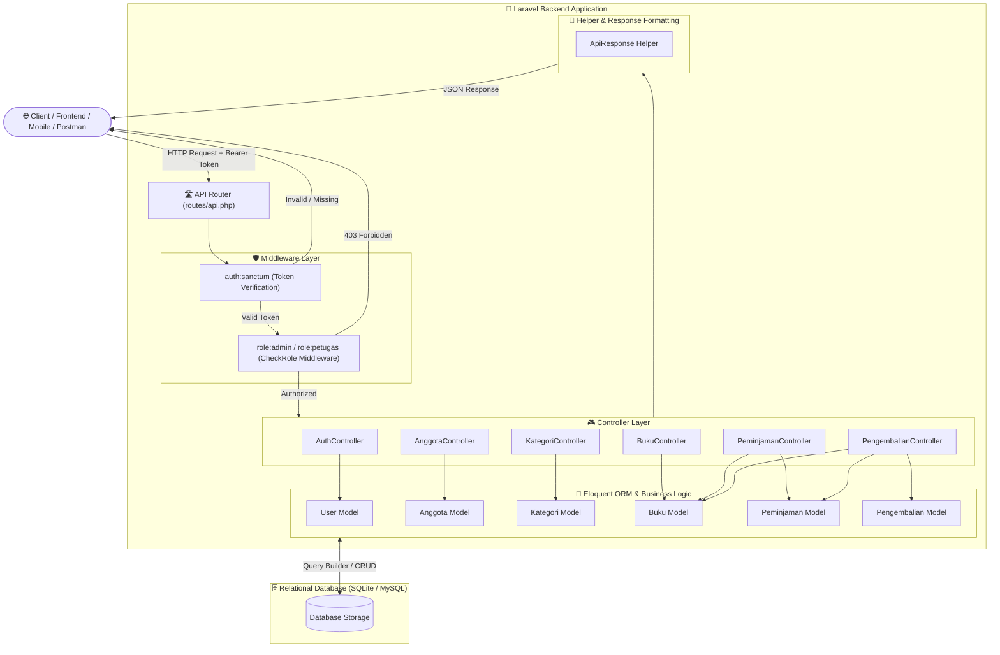
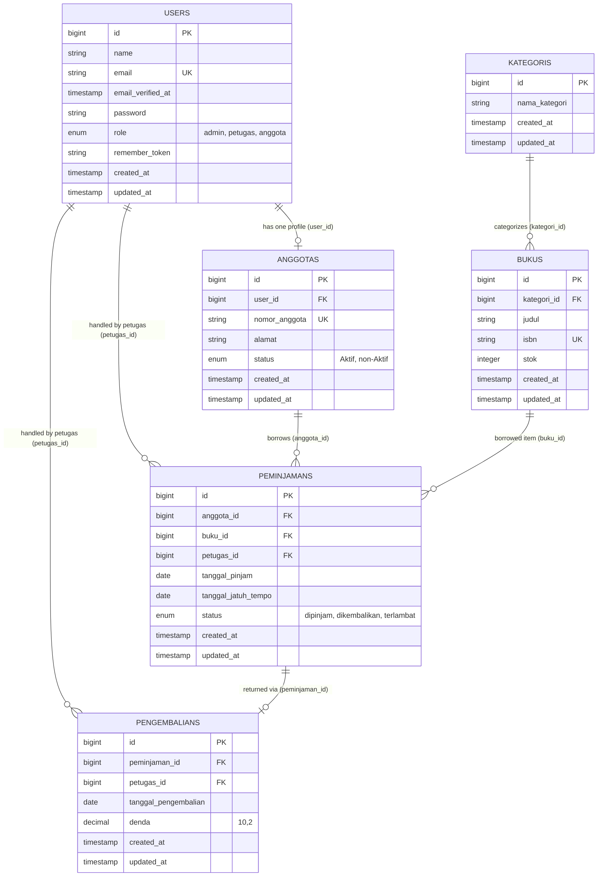
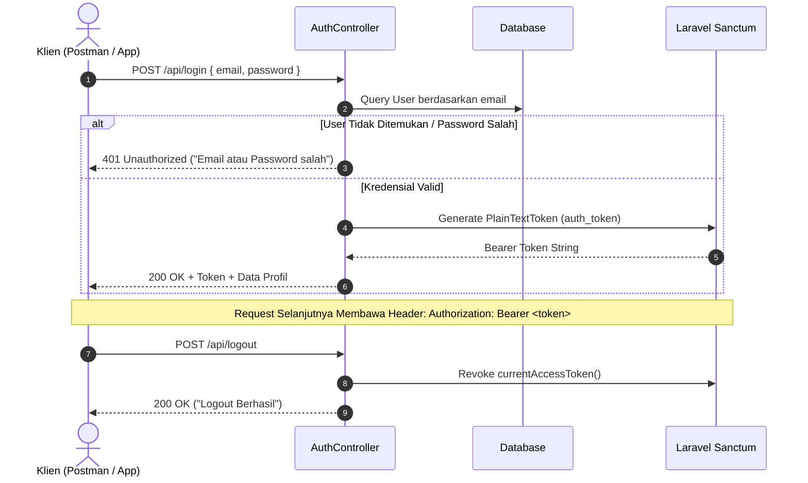
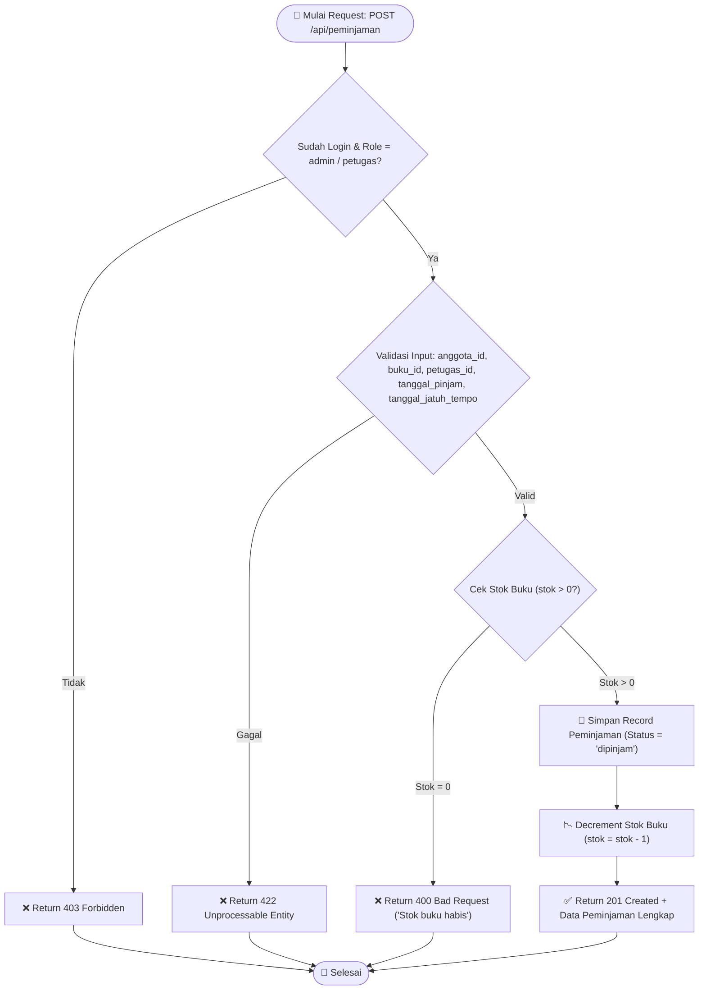
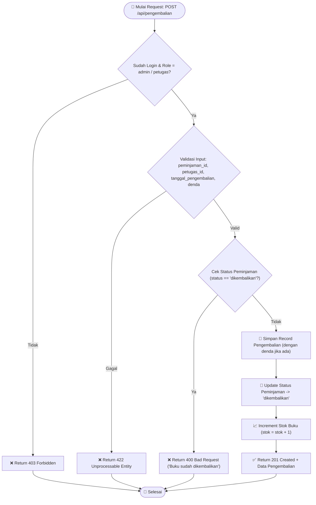

# 📚 Sistem Informasi Manajemen Perpustakaan (Library API)

<p align="center">
  
</p>

<p align="center">
  <strong>RESTful API backend modern untuk pengelolaan sirkulasi buku, keanggotaan, peminjaman, dan pengembalian perpustakaan berbasis Laravel 11/12 & Laravel Sanctum.</strong>
</p>

<p align="center">
  
  
  
  
  
</p>

---

## 📑 Daftar Isi

- [📚 Sistem Informasi Manajemen Perpustakaan (Library API)](#-sistem-informasi-manajemen-perpustakaan-library-api)
  - [📑 Daftar Isi](#-daftar-isi)
  - [✨ Fitur Utama](#-fitur-utama)
  - [🏗️ Arsitektur Sistem](#️-arsitektur-sistem)
  - [👥 Role \& Hak Akses (RBAC)](#-role--hak-akses-rbac)
  - [🗄️ Database \& Entity Relationship Diagram (ERD)](#️-database--entity-relationship-diagram-erd)
    - [Diagram ERD](#diagram-erd)
    - [Spesifikasi Tabel \& Kolom](#spesifikasi-tabel--kolom)
  - [🔄 Alur \& Diagram Proses Bisnis](#-alur--diagram-proses-bisnis)
    - [1. Alur Autentikasi \& Otorisasi Token Sanctum](#1-alur-autentikasi--otorisasi-token-sanctum)
    - [2. Alur Transaksi Peminjaman Buku](#2-alur-transaksi-peminjaman-buku)
    - [3. Alur Transaksi Pengembalian \& Restok Buku](#3-alur-transaksi-pengembalian--restok-buku)
  - [🚀 Panduan Instalasi \& Setup](#-panduan-instalasi--setup)
    - [Prasyarat Sistem](#prasyarat-sistem)
    - [Langkah-Langkah Instalasi](#langkah-langkah-instalasi)
    - [Akun Bawaan (Seeder)](#akun-bawaan-seeder)
  - [📖 Dokumentasi Lengkap Endpoint API](#-dokumentasi-lengkap-endpoint-api)
    - [1. Authentication \& User Management](#1-authentication--user-management)
      - [A. Register User](#a-register-user)
      - [B. Login](#b-login)
      - [C. Logout](#c-logout)
      - [D. Update Role (Admin Only)](#d-update-role-admin-only)
    - [2. Modul Kategori Buku (`/api/kategori`)](#2-modul-kategori-buku-apikategori)
    - [3. Modul Buku (`/api/buku`)](#3-modul-buku-apibuku)
    - [4. Modul Anggota (`/api/anggota`)](#4-modul-anggota-apianggota)
    - [5. Modul Transaksi Peminjaman (`/api/peminjaman`)](#5-modul-transaksi-peminjaman-apipeminjaman)
    - [6. Modul Transaksi Pengembalian (`/api/pengembalian`)](#6-modul-transaksi-pengembalian-apipengembalian)
  - [⚡ Standar Respon \& Error Handling](#-standar-respon--error-handling)
  - [📂 Struktur Direktori Proyek](#-struktur-direktori-proyek)
  - [🧪 Pengujian API (cURL Examples)](#-pengujian-api-curl-examples)

---

## ✨ Fitur Utama

- 🔐 **Autentikasi Token-Based (Laravel Sanctum)**: Sistem registrasi, login, logout, dan manajemen bearer token yang aman.
- 🛡️ **Role-Based Access Control (RBAC)**: Tiga tingkat hak akses berjenjang (`admin`, `petugas`, dan `anggota`) dengan validasi middleware terpusat.
- 📖 **Katalog Buku & Kategori**: Manajemen inventaris buku lengkap dengan nomor ISBN unik, relasi kategori, dan tracking stok realtime.
- 🪪 **Manajemen Anggota**: Pengelolaan data profil anggota perpustakaan yang terhubung dengan akun user, nomor anggota unik, alamat, serta status keanggotaan.
- 🔄 **Sirkulasi Peminjaman Otomatis**:
  - Validasi ketersediaan stok buku secara instan.
  - Otomatisasi pemotongan kuota stok (*auto-decrement*) saat peminjaman berhasil.
  - Validasi tanggal jatuh tempo terhadap tanggal peminjaman.
- 📦 **Sirkulasi Pengembalian & Denda**:
  - Deteksi status peminjaman untuk mencegah duplikasi pengembalian.
  - Otomatisasi pengembalian kuota stok (*auto-increment*).
  - Perhitungan dan pencatatan nominal denda keterlambatan/kerusakan.
- 📦 **Standardized API Response**: Menggunakan helper `ApiResponse` dan format response konsisten untuk mempermudah integrasi klien Frontend/Mobile.

---

## 🏗️ Arsitektur Sistem

Berikut adalah arsitektur request-response pipeline pada aplikasi ini:



---

## 👥 Role & Hak Akses (RBAC)

Aplikasi menerapkan 3 level hak akses (*Role-Based Access Control*):

| Modul / Endpoint | Method | Admin | Petugas | Anggota |
| :--- | :--- | :---: | :---: | :---: |
| **Auth: Register & Login** | `POST` | ✅ | ✅ | ✅ |
| **Auth: Logout** | `POST` | ✅ | ✅ | ✅ |
| **Auth: Update User Role** | `PATCH` | ✅ | ❌ | ❌ |
| **Kategori: Lihat Semua / Detail** | `GET` | ✅ | ✅ | ✅ |
| **Kategori: Tambah & Ubah** | `POST`, `PUT/PATCH` | ✅ | ❌ | ❌ |
| **Kategori: Hapus** | `DELETE` | ✅ | ❌ | ❌ |
| **Buku: Lihat Katalog / Detail** | `GET` | ✅ | ✅ | ✅ |
| **Buku: Tambah & Ubah** | `POST`, `PUT/PATCH` | ✅ | ✅ | ❌ |
| **Buku: Hapus** | `DELETE` | ✅ | ❌ | ❌ |
| **Anggota: Lihat Semua / Detail** | `GET` | ✅ | ✅ | ✅ |
| **Anggota: Tambah, Ubah, Hapus** | `POST`, `PUT`, `DELETE` | ✅ | ❌ | ❌ |
| **Peminjaman: Lihat Data / Detail** | `GET` | ✅ | ✅ | ❌ |
| **Peminjaman: Buat Transaksi** | `POST` | ✅ | ✅ | ❌ |
| **Peminjaman: Hapus Transaksi** | `DELETE` | ✅ | ❌ | ❌ |
| **Pengembalian: Lihat & Catat** | `GET`, `POST` | ✅ | ✅ | ❌ |

---

## 🗄️ Database & Entity Relationship Diagram (ERD)

### Diagram ERD



### Spesifikasi Tabel & Kolom

1. **`users`**: Menyimpan kredensial autentikasi dan level otorisasi (`admin`, `petugas`, `anggota`).
2. **`anggotas`**: Menyimpan profil keanggotaan perpustakaan dengan relasi *One-to-One* ke `users`.
3. **`kategoris`**: Menyimpan klasifikasi kategori buku (contoh: *Teknologi, Sains, Sastra, Sejarah*).
4. **`bukus`**: Menyimpan daftar buku, referensi kategori, kode ISBN unik, dan jumlah stok tersedia.
5. **`peminjamans`**: Menyimpan transaksi sirkulasi peminjaman, tanggal pinjam, batas waktu kembali, serta status peminjaman.
6. **`pengembalians`**: Menyimpan bukti penyelesaian peminjaman, petugas penerima, tanggal aktual kembali, dan nominal denda.

---

## 🔄 Alur & Diagram Proses Bisnis

### 1. Alur Autentikasi & Otorisasi Token Sanctum



---

### 2. Alur Transaksi Peminjaman Buku

Proses peminjaman memvalidasi hak akses, integritas data, ketersediaan stok, dan secara atomik mengurangi kuota stok buku:



---

### 3. Alur Transaksi Pengembalian & Restok Buku

Proses pengembalian memvalidasi bahwa buku belum pernah dikembalikan sebelumnya, mencatat denda, memperbarui status menjadi `dikembalikan`, dan mengembalikan jumlah stok buku:



---

## 🚀 Panduan Instalasi & Setup

### Prasyarat Sistem

Pastikan environment lokal telah memenuhi spesifikasi berikut:
- **PHP** >= 8.2 (Direkomendasikan **PHP 8.3**)
- **Composer** >= 2.x
- **Node.js** >= 18.x & **NPM**
- **Database Engine**: SQLite (default) atau MySQL / PostgreSQL / MariaDB
- Ekstensi PHP yang aktif: `pdo`, `pdo_sqlite` / `pdo_mysql`, `mbstring`, `openssl`, `tokenizer`, `xml`, `ctype`, `json`, `bcmath`.

---

### Langkah-Langkah Instalasi

1. **Clone Repositori**:
   ```bash
   git clone <repository_url>
   cd latihan-perpustakaan
   ```

2. **Install Dependensi PHP via Composer**:
   ```bash
   composer install
   ```

3. **Install Dependensi Frontend/Asset via NPM**:
   ```bash
   npm install
   ```

4. **Konfigurasi Environment (`.env`)**:
   Salin file template environment:
   ```bash
   cp .env.example .env
   ```
   > [!NOTE]
   > Jika menggunakan SQLite, pastikan file database tersedia:
   > ```bash
   > touch database/database.sqlite
   > ```
   > Atau sesuaikan variabel koneksi database MySQL pada file `.env`:
   > ```env
   > DB_CONNECTION=mysql
   > DB_HOST=127.0.0.1
   > DB_PORT=3306
   > DB_DATABASE=latihan_perpustakaan
   > DB_USERNAME=root
   > DB_PASSWORD=
   > ```

5. **Generate Application Encryption Key**:
   ```bash
   php artisan key:generate
   ```

6. **Jalankan Migrasi Database & Seeder Bawaan**:
   ```bash
   php artisan migrate --seed
   ```

7. **Jalankan Development Server**:
   ```bash
   php artisan serve
   ```
   API akan aktif dan siap menerima request pada: **`http://localhost:8000/api`**

---

### Akun Bawaan (Seeder)

Database seeder (`UserSeeder`) menyediakan 3 akun default untuk pengujian:

| Role | Email | Password Default | Hak Akses |
| :--- | :--- | :--- | :--- |
| **Admin** | `admin@perpus.com` | `password123` | Akses Penuh (CRUD Seluruh Modul + Role Management) |
| **Petugas** | `petugas@perpus.com` | `password123` | Sirkulasi Peminjaman & Pengembalian, Kelola Buku |
| **Anggota** | `anggota@perpus.com` | `password123` | Read-only Katalog Buku & Kategori |

---

## 📖 Dokumentasi Lengkap Endpoint API

> **Base URL**: `http://localhost:8000/api`  
> **Headers Standar untuk Endpoint Terproteksi**:
> ```http
> Accept: application/json
> Content-Type: application/json
> Authorization: Bearer <YOUR_ACCESS_TOKEN>
> ```

---

### 1. Authentication & User Management

#### A. Register User
- **Method**: `POST`
- **URL**: `/register`
- **Auth Required**: `No`
- **Request Body**:
  ```json
  {
    "name": "Budi Santoso",
    "email": "budi@example.com",
    "password": "password123",
    "role": "anggota"
  }
  ```
- **Response Success (`201 Created`)**:
  ```json
  {
    "success": true,
    "message": "Registrasi Berhasil",
    "access_token": "1|qWb...sampletoken...",
    "token_type": "Bearer",
    "data": {
      "id": 4,
      "name": "Budi Santoso",
      "email": "budi@example.com",
      "role": "anggota",
      "created_at": "2026-08-17T11:15:00.000000Z",
      "updated_at": "2026-08-17T11:15:00.000000Z"
    }
  }
  ```

---

#### B. Login
- **Method**: `POST`
- **URL**: `/login`
- **Auth Required**: `No`
- **Request Body**:
  ```json
  {
    "email": "admin@perpus.com",
    "password": "password123"
  }
  ```
- **Response Success (`200 OK`)**:
  ```json
  {
    "success": true,
    "message": "Login Berhasil",
    "access_token": "2|9Zk...sampletoken...",
    "token_type": "Bearer",
    "data": {
      "id": 1,
      "name": "Admin Perpustakaan",
      "email": "admin@perpus.com",
      "role": "admin"
    }
  }
  ```

---

#### C. Logout
- **Method**: `POST`
- **URL**: `/logout`
- **Auth Required**: `Yes (auth:sanctum)`
- **Response Success (`200 OK`)**:
  ```json
  {
    "success": true,
    "message": "Logout Berhasil"
  }
  ```

---

#### D. Update Role (Admin Only)
- **Method**: `PATCH`
- **URL**: `/user/{id}/role`
- **Auth Required**: `Yes (Role: admin)`
- **Request Body**:
  ```json
  {
    "role": "petugas"
  }
  ```
- **Response Success (`200 OK`)**:
  ```json
  {
    "success": true,
    "message": "Role berhasil diupdate",
    "data": {
      "id": 4,
      "name": "Budi Santoso",
      "email": "budi@example.com",
      "role": "petugas"
    }
  }
  ```

---

### 2. Modul Kategori Buku (`/api/kategori`)

| Method | Endpoint | Role Diizinkan | Deskripsi |
| :--- | :--- | :--- | :--- |
| `GET` | `/kategori` | All Authenticated | Menampilkan semua kategori buku |
| `POST` | `/kategori` | `admin` | Menambahkan kategori buku baru |
| `GET` | `/kategori/{id}` | All Authenticated | Mengambil detail kategori spesifik |
| `PUT/PATCH` | `/kategori/{id}` | `admin` | Memperbarui nama kategori |
| `DELETE` | `/kategori/{id}` | `admin` | Menghapus data kategori |

**Contoh Payload Request Tambah Kategori (`POST /kategori`)**:
```json
{
  "nama_kategori": "Sains & Teknologi"
}
```

**Contoh Response Kategori (`200 OK / 201 Created`)**:
```json
{
  "message": "Kategori berhasil ditambahkan",
  "data": {
    "id": 1,
    "nama_kategori": "Sains & Teknologi",
    "created_at": "2026-08-17T11:20:00.000000Z",
    "updated_at": "2026-08-17T11:20:00.000000Z"
  }
}
```

---

### 3. Modul Buku (`/api/buku`)

| Method | Endpoint | Role Diizinkan | Deskripsi |
| :--- | :--- | :--- | :--- |
| `GET` | `/buku` | All Authenticated | Menampilkan semua buku beserta relasi kategori |
| `POST` | `/buku` | `admin`, `petugas` | Menambahkan item buku baru |
| `GET` | `/buku/{id}` | All Authenticated | Mengambil detail buku dan kategori terkait |
| `PUT/PATCH` | `/buku/{id}` | `admin`, `petugas` | Memperbarui data buku |
| `DELETE` | `/buku/{id}` | `admin` | Menghapus buku dari sistem |

**Contoh Payload Request Tambah Buku (`POST /buku`)**:
```json
{
  "kategori_id": 1,
  "judul": "Clean Architecture & Design Patterns",
  "isbn": "978-602-03-8888-1",
  "stok": 15
}
```

**Contoh Response Buku (`200 OK / 201 Created`)**:
```json
{
  "success": true,
  "message": "Buku berhasil ditambahkan",
  "data": {
    "id": 1,
    "kategori_id": 1,
    "judul": "Clean Architecture & Design Patterns",
    "isbn": "978-602-03-8888-1",
    "stok": 15,
    "created_at": "2026-08-17T11:25:00.000000Z",
    "updated_at": "2026-08-17T11:25:00.000000Z"
  }
}
```

---

### 4. Modul Anggota (`/api/anggota`)

| Method | Endpoint | Role Diizinkan | Deskripsi |
| :--- | :--- | :--- | :--- |
| `GET` | `/anggota` | All Authenticated | Menampilkan daftar seluruh anggota perpustakaan |
| `POST` | `/anggota` | `admin` | Mendaftarkan profil anggota baru |
| `GET` | `/anggota/{id}` | All Authenticated | Mengambil rincian data anggota |
| `PUT/PATCH` | `/anggota/{id}` | `admin` | Memperbarui informasi anggota |
| `DELETE` | `/anggota/{id}` | `admin` | Menghapus data anggota |

**Contoh Payload Request Tambah Anggota (`POST /anggota`)**:
```json
{
  "user_id": 3,
  "nomor_anggota": "LIB-2026-0001",
  "alamat": "Jl. Sudirman No. 45, Jakarta Selatan",
  "status": "aktif"
}
```

---

### 5. Modul Transaksi Peminjaman (`/api/peminjaman`)

| Method | Endpoint | Role Diizinkan | Deskripsi |
| :--- | :--- | :--- | :--- |
| `GET` | `/peminjaman` | `admin`, `petugas` | Menampilkan seluruh riwayat transaksi peminjaman |
| `POST` | `/peminjaman` | `admin`, `petugas` | Mencatat transaksi peminjaman baru & auto-decrement stok |
| `GET` | `/peminjaman/{id}` | `admin`, `petugas` | Mengambil rincian peminjaman beserta relasinya |
| `DELETE` | `/peminjaman/{id}` | `admin` | Menghapus rekaman peminjaman |

**Contoh Payload Request Peminjaman (`POST /peminjaman`)**:
```json
{
  "anggota_id": 1,
  "buku_id": 1,
  "petugas_id": 2,
  "tanggal_pinjam": "2026-08-17",
  "tanggal_jatuh_tempo": "2026-08-24"
}
```

**Contoh Response Peminjaman Berhasil (`201 Created`)**:
```json
{
  "success": true,
  "message": "Transaksi peminjaman berhasil dicatat",
  "data": {
    "id": 1,
    "anggota_id": 1,
    "buku_id": 1,
    "petugas_id": 2,
    "tanggal_pinjam": "2026-08-17",
    "tanggal_jatuh_tempo": "2026-08-24",
    "status": "dipinjam",
    "created_at": "2026-08-17T11:30:00.000000Z",
    "updated_at": "2026-08-17T11:30:00.000000Z",
    "anggota": {
      "id": 1,
      "nomor_anggota": "LIB-2026-0001",
      "alamat": "Jl. Sudirman No. 45",
      "user": {
        "id": 3,
        "name": "Anggota Perpus",
        "email": "anggota@perpus.com"
      }
    },
    "buku": {
      "id": 1,
      "judul": "Clean Architecture & Design Patterns",
      "isbn": "978-602-03-8888-1",
      "stok": 14
    },
    "petugas": {
      "id": 2,
      "name": "Petugas Perpus",
      "email": "petugas@perpus.com"
    }
  }
}
```

---

### 6. Modul Transaksi Pengembalian (`/api/pengembalian`)

| Method | Endpoint | Role Diizinkan | Deskripsi |
| :--- | :--- | :--- | :--- |
| `GET` | `/pengembalian` | `admin`, `petugas` | Menampilkan seluruh riwayat pengembalian |
| `POST` | `/pengembalian` | `admin`, `petugas` | Memproses pengembalian buku, denda & auto-increment stok |

**Contoh Payload Request Pengembalian (`POST /pengembalian`)**:
```json
{
  "peminjaman_id": 1,
  "petugas_id": 2,
  "tanggal_pengembalian": "2026-08-20",
  "denda": 0
}
```

**Contoh Response Pengembalian Berhasil (`201 Created`)**:
```json
{
  "success": true,
  "message": "Buku berhasil dikembalikan dan stok diperbarui",
  "data": {
    "id": 1,
    "peminjaman_id": 1,
    "petugas_id": 2,
    "tanggal_pengembalian": "2026-08-20",
    "denda": 0,
    "created_at": "2026-08-17T11:35:00.000000Z",
    "updated_at": "2026-08-17T11:35:00.000000Z",
    "peminjaman": {
      "id": 1,
      "status": "dikembalikan",
      "buku_id": 1
    },
    "petugas": {
      "id": 2,
      "name": "Petugas Perpus"
    }
  }
}
```

---

## ⚡ Standar Respon & Error Handling

Aplikasi mengembalikan struktur format HTTP status code standar:

| Status Code | Kondisi | Contoh Format Respon |
| :--- | :--- | :--- |
| `200 OK` | Operasi pengambilan data, pembaruan data, atau logout berhasil. | `{"success": true, "message": "...", "data": {...}}` |
| `201 Created` | Pembuatan entitas baru (Buku, Anggota, Transaksi) berhasil. | `{"success": true, "message": "...", "data": {...}}` |
| `400 Bad Request` | Pelanggaran aturan bisnis (cth: stok buku habis, buku sudah dikembalikan). | `{"success": false, "message": "Stok buku habis, tidak dapat dipinjam"}` |
| `401 Unauthorized` | Belum terautentikasi atau token tidak valid/kedaluwarsa. | `{"message": "Unauthenticated."}` |
| `403 Forbidden` | Role akun tidak memiliki wewenang untuk endpoint tersebut. | `{"success": false, "message": "Anda tidak memiliki akses untuk mengakses operasi ini!"}` |
| `404 Not Found` | Resource ID yang diminta tidak ditemukan di database. | `{"success": false, "message": "Data tidak ditemukan"}` |
| `422 Unprocessable Entity` | Kegagalan validasi form request input. | `{"message": "The given data was invalid.", "errors": {...}}` |

---

## 📂 Struktur Direktori Proyek

```plaintext
latihan-perpustakaan/
├── app/
│   ├── Helpers/
│   │   └── ApiResponse.php           # Helper standarisasi respon JSON
│   ├── Http/
│   │   ├── Controllers/
│   │   │   ├── AnggotaController.php       # Controller CRUD Anggota
│   │   │   ├── AuthController.php          # Controller Register, Login, Logout, Role
│   │   │   ├── BukuController.php          # Controller CRUD Buku & Stok
│   │   │   ├── Controller.php              # Base Controller
│   │   │   ├── KategoriController.php      # Controller CRUD Kategori Buku
│   │   │   ├── PeminjamanController.php    # Controller Sirkulasi Peminjaman & Auto Decrement
│   │   │   └── PengembalianController.php  # Controller Sirkulasi Pengembalian & Auto Increment
│   │   └── Middleware/
│   │       └── CheckRole.php               # Middleware RBAC (admin, petugas, anggota)
│   └── Models/
│       ├── Anggota.php                     # Eloquent Model Anggota (FK: user_id)
│       ├── Buku.php                        # Eloquent Model Buku (FK: kategori_id)
│       ├── Kategori.php                    # Eloquent Model Kategori
│       ├── Peminjaman.php                  # Eloquent Model Peminjaman (FK: anggota_id, buku_id, petugas_id)
│       ├── Pengembalian.php                # Eloquent Model Pengembalian (FK: peminjaman_id, petugas_id)
│       └── User.php                        # Eloquent Model User (Sanctum Tokens & Role)
├── bootstrap/
│   └── app.php                             # Registrasi Middleware Alias & Exception Handler
├── config/                                 # File konfigurasi framework
├── database/
│   ├── migrations/                         # Skema tabel database (DDL)
│   └── seeders/
│       ├── DatabaseSeeder.php              # Master Seeder Runner
│       └── UserSeeder.php                  # Default User & Role Seeder
├── routes/
│   ├── api.php                             # Definisi Seluruh Route REST API & Middleware Group
│   └── web.php                             # Route Web Dasar
├── composer.json                           # Dependensi & Metadata Composer
└── README.md                               # Dokumentasi Teknis Sistem
```

---

## 🧪 Pengujian API (cURL Examples)

Gunakan perintah cURL berikut pada terminal untuk menguji alur kerja end-to-end:

### 1. Login Petugas & Simpan Token
```bash
TOKEN=$(curl -s -X POST http://localhost:8000/api/login \
  -H "Content-Type: application/json" \
  -H "Accept: application/json" \
  -d '{"email":"petugas@perpus.com","password":"password123"}' | grep -o '"access_token":"[^"]*' | cut -d'"' -f4)

echo "Token diperoleh: $TOKEN"
```

### 2. Ambil Daftar Buku
```bash
curl -X GET http://localhost:8000/api/buku \
  -H "Accept: application/json" \
  -H "Authorization: Bearer $TOKEN"
```

### 3. Buat Transaksi Peminjaman Buku
```bash
curl -X POST http://localhost:8000/api/peminjaman \
  -H "Content-Type: application/json" \
  -H "Accept: application/json" \
  -H "Authorization: Bearer $TOKEN" \
  -d '{
    "anggota_id": 1,
    "buku_id": 1,
    "petugas_id": 2,
    "tanggal_pinjam": "2026-08-17",
    "tanggal_jatuh_tempo": "2026-08-24"
  }'
```

### 4. Proses Pengembalian Buku
```bash
curl -X POST http://localhost:8000/api/pengembalian \
  -H "Content-Type: application/json" \
  -H "Accept: application/json" \
  -H "Authorization: Bearer $TOKEN" \
  -d '{
    "peminjaman_id": 1,
    "petugas_id": 2,
    "tanggal_pengembalian": "2026-08-20",
    "denda": 0
  }'
```

---

## 🛡️ Lisensi & Kontribusi

Proyek ini dikembangkan untuk kebutuhan latihan dan sistem perpustakaan berbasis open-source di bawah lisensi [MIT License](LICENSE). Silakan gunakan dan kembangkan sesuai kebutuhan.
